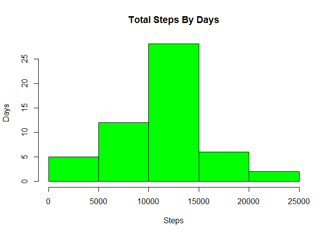
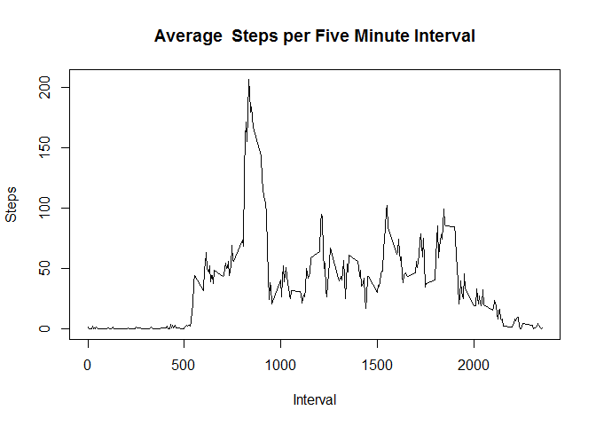
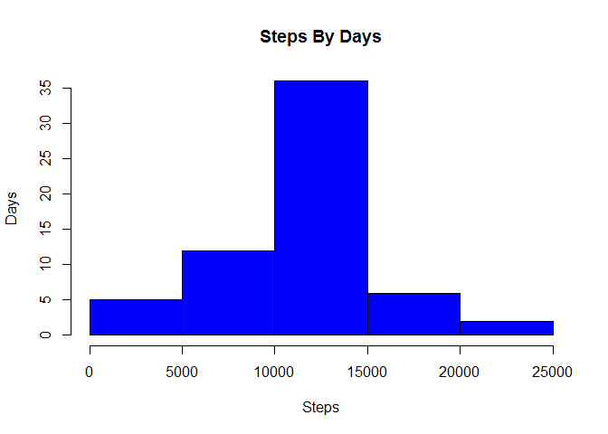
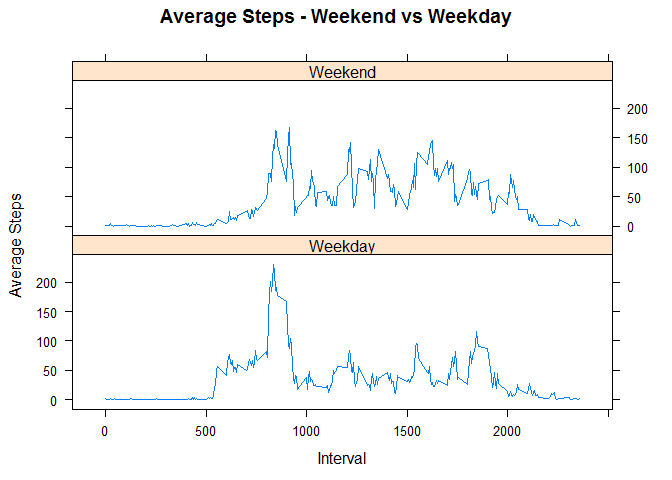

# Reproducible Research: Peer Assessment 1


## Loading and preprocessing the data
The data was downloaded from the website - https://d396qusza40orc.cloudfront.net/repdata%2Fdata%2Factivity.zip on 2/17/2016. The file "activity.csv" contains the data for this project. The file contains 17,568 observations and contains the following variables:
*steps: Number of steps taking in a 5-minute interval (missing values are coded as NA)
*date: The date on which the measurement was taken in YYYY-MM-DD format
*interval: Identifier for the 5-minute interval in which measurement was taken

###Loading the data


```r
        # Load the data
        activity_data <- read.csv("activity.csv", header = TRUE)
```

###Processing the data
 Setting the variable "date" to the data type Date and variable "interval" as an integer.


```r
        #Format the variables to the correct data type
        activity_data$date = as.Date(activity_data$date)
        activity_data$interval = as.integer(activity_data$interval)
```
### Loading the libraries required for the project.


```r
       #Loading the libraries required for the project 
        library(plyr)
        library(dplyr)
```

```
## 
## Attaching package: 'dplyr'
```

```
## The following objects are masked from 'package:plyr':
## 
##     arrange, count, desc, failwith, id, mutate, rename, summarise,
##     summarize
```

```
## The following objects are masked from 'package:stats':
## 
##     filter, lag
```

```
## The following objects are masked from 'package:base':
## 
##     intersect, setdiff, setequal, union
```

```r
        library(lattice)
        library(chron)
```
        
## What is mean total number of steps taken per day?

###Histogram of Total Number of Steps taken Each Day


```r
        #Get the total number of steps by day
        steps_by_day <- ddply(activity_data,"date",summarize,steps = sum(steps,na.rm = FALSE))
        
        # Plot a histogram for the total number of steps by day
        hist(steps_by_day$steps, xlab = "Steps", ylab = "Days", main = "Total Steps By Days",col="green")
```




###Mean of Total Steps Taken Per Day


```r
        #mean calculated with missing values in the data
        mean_steps_by_day <- mean(steps_by_day$steps,na.rm = TRUE)
        mean_steps_by_day
```

```
## [1] 10766.19
```

###Median of Total Steps Taken Per Day


```r
        # median calculated with missing values in the data
        median_steps_by_day <- median(steps_by_day$steps,na.rm = TRUE)
        median_steps_by_day
```

```
## [1] 10765
```

## What is the average daily activity pattern?


```r
        # get the average stebs by interval
        average_steps_by_interval <- ddply(activity_data,"interval",summarize,avgSteps = mean(steps,na.rm = TRUE))
        
        # plot a graph to show the average steps by interval
        plot(average_steps_by_interval$interval, average_steps_by_interval$avgSteps, type = "l", main = "Average  Steps per Five Minute Interval", xlab = "Interval",ylab = "Steps" )
```



## Imputing missing values
###Calculate and report the total number of missing values in the dataset
(i.e. the total number of rows with NAs)


```r
        # get the number of rows with missing data
        Missing_Data <- subset(activity_data, is.na(steps))
        nrow(Missing_Data)
```

```
## [1] 2304
```


###Devise a strategy for filling in all of the missing values in the dataset. 

My strategy will be to use the mean for the 5- minute interval that was calculated for the previous question. I will use the functions inner_join and mutate to update the missing values with the mean calculated for the 5 minute period. My code will have checks to ensure that the value is updated only if the value is missing.

###Create a new dataset that is equal to the original dataset but with the missing data filled in.


```r
        # insert into missing values the mean  for the corresponding time interval using         #inner_join & mutate
        activity_imputed <- inner_join(activity_data, 
                            average_steps_by_interval, 
                            by="interval") %>% 
                            mutate(steps=ifelse(is.na(steps),avgSteps,steps)) %>%
                            select(date,interval,steps)
```
###Make a Histogram of the total number of steps taken each day after inserting values for missing values 


```r
       # Use ddply to summarize the total steps 
        no_NA_steps_by_day <- ddply(activity_imputed,"date",summarize,steps = sum(steps))
        
        # plot a histogram
        hist(no_NA_steps_by_day$steps, xlab = "Steps", ylab = "Days", main = "Steps By Days",col="blue")     
```


###Calculate the mean and median total number of steps taken per day after inserting missing data

```r
        # mean after inserting values for missing values
        no_NA_mean_of_steps <- mean(no_NA_steps_by_day$steps) 
        no_NA_mean_of_steps
```

```
## [1] 10766.19
```

```r
        # median after inserting values for missing values
        no_NA_median_of_steps <- median(no_NA_steps_by_day$steps)
        no_NA_median_of_steps
```

```
## [1] 10766.19
```

###Do these values differ from the estimates from the first part of the assignment?
The mean of the steps by day after inserting the missing values is an exact match with the mean of the steps by day with missing values. The mean value is 10766.19

The median before inserting the missing values is 10765 and after inserting the missing value is 10766.19. 

Inserting the missing data returns in the same value for both the mean and the median.

## Are there differences in activity patterns between weekdays and weekends?

###Add a new variable to the data frame to indicate if the day is a weekday or weekend

```r
        # Using the is.weekend function determine if the day is a weekday or weekend
        
        activity_imputed$day = ifelse(is.weekend(activity_imputed$date),"Weekend","Weekday")
```
###Plot a panel plot to display average steps by weekday or weekend

```r
        ## Summarize data by interval and type of day - Weekend vs Weekday
        activity_interval_day <- ddply(activity_imputed, .(interval, day), summarize, Avg = mean(steps))
        

        ##Plot data in a panel plot
        xyplot(Avg~interval|day, data=activity_interval_day, type="l",  layout = c(1,2),
       main="Average Steps - Weekend vs Weekday", 
       ylab="Average Steps", xlab="Interval")
```


 
###The average steps taken is more during the weekend when compared with the steps taken during the weekday. There is less fluctuation in the average steps taken during the weekend when compared with the average steps taken during th weekday.
